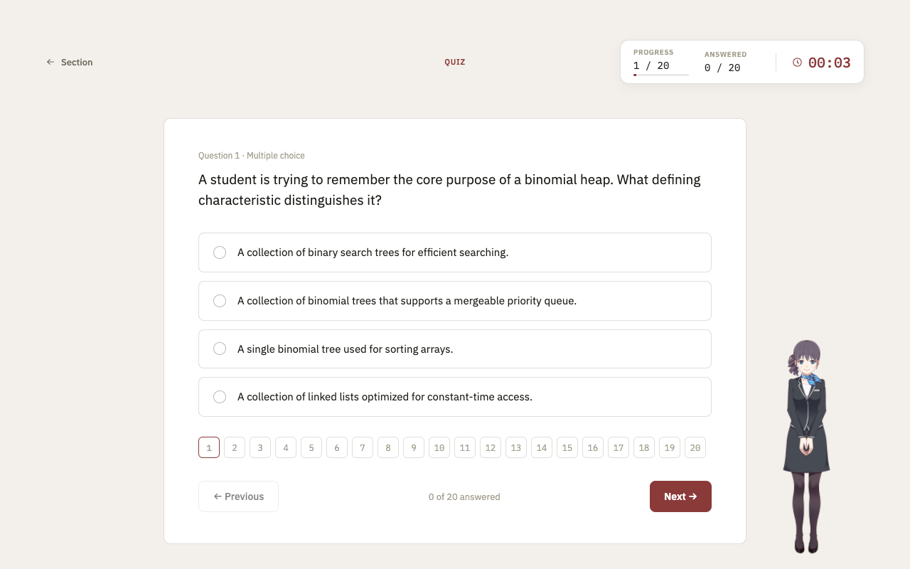
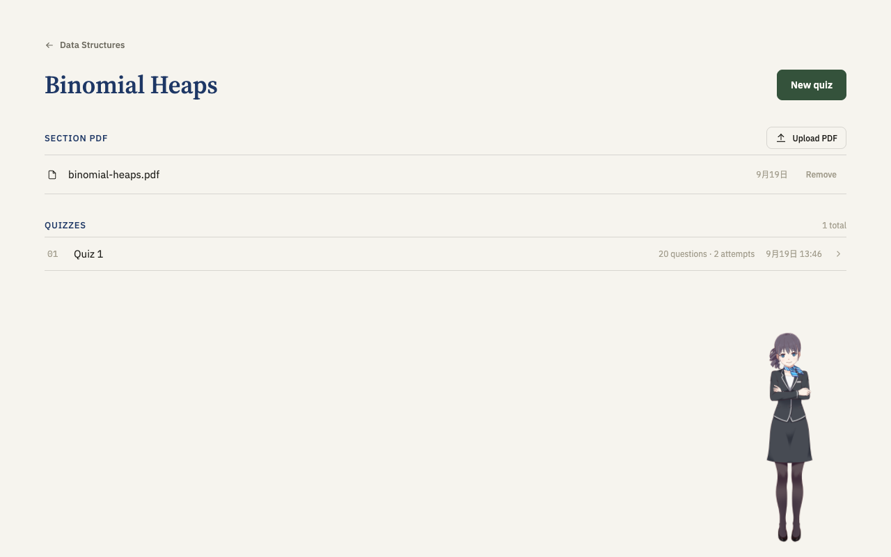
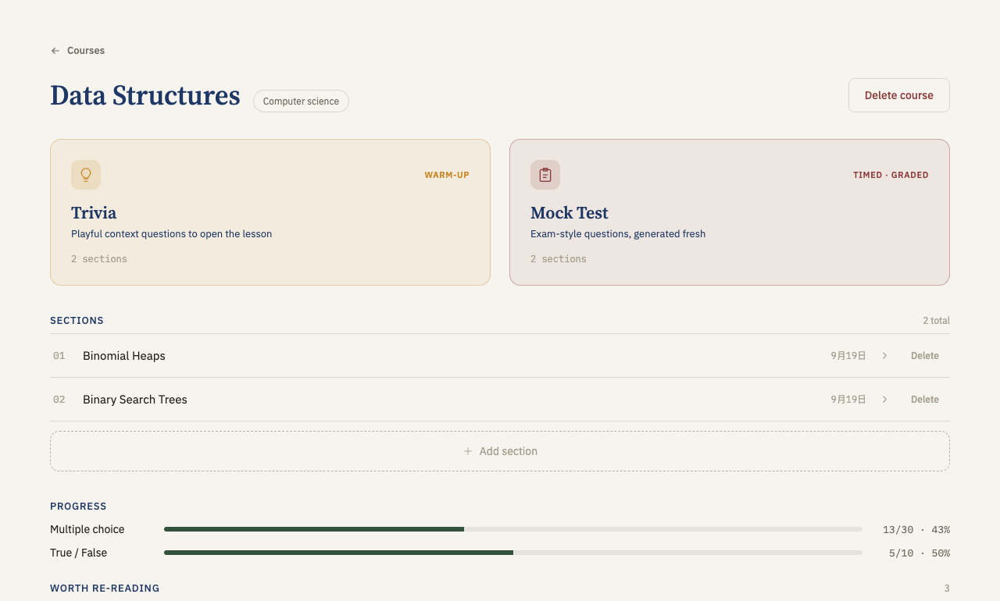
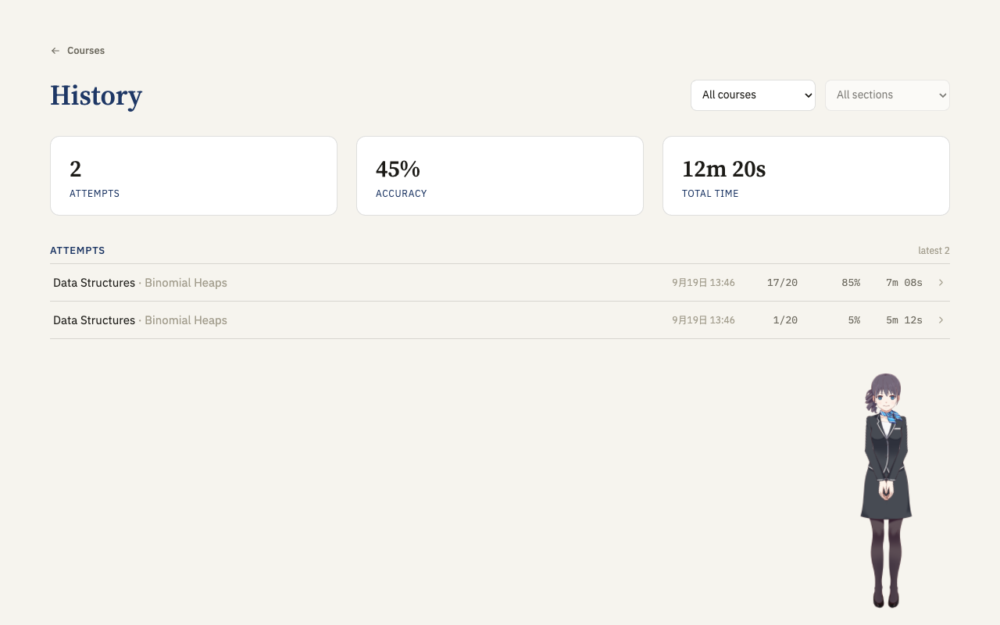
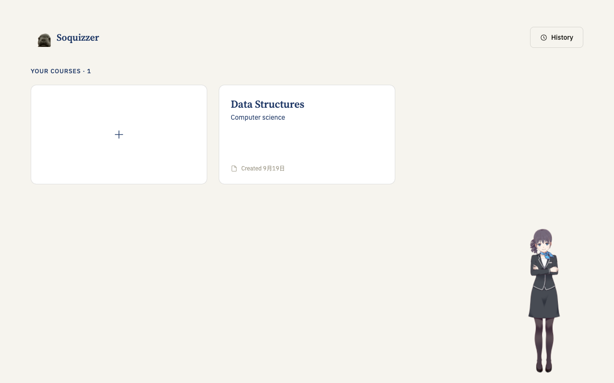
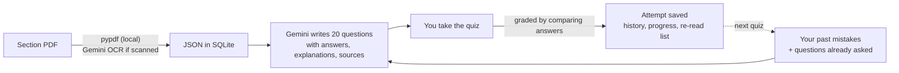

<p align="center">
  
</p>

# Soquizzer

<p align="center">
  
  
  
  
  
</p>

<p align="center">
  
  
  
  
</p>

*Soquizzer organizes your course content and generates quizzes to help you understand the material: upload a PDF for each section of a course, and get fresh quizzes written from it, with explanations, source pointers and a memory of what you keep getting wrong.*

*Soquizzer 把课程内容按章节整理起来：每个 section 上传一份 PDF，就能根据它生成一份份新的 quiz，附带解析、原文出处，并记住你总是做错的地方。*

Studying from slides and lecture notes usually means re-reading and hoping it sticks. Soquizzer turns that material into active practice. A course is split into **sections**; every section owns its PDF, and every quiz in the section is written from that PDF only. Ask for another quiz and you get a different one: the app remembers which questions you already saw and which ones you still get wrong, and aims the next round at your gaps.

* Courses → sections → quizzes, with one PDF per section as the single source of truth for its questions
* 20 questions per quiz (multiple choice and true/false), graded instantly with an explanation and the passage to re-read
* Mistake memory, a "worth re-reading" list, and a history of every attempt with score, accuracy and time spent
* A Live2D study pet that cheers you on, plus a desktop app (Electron) or a browser build

<p align="center">
  
</p>

---

## Table of Contents

* [Quick Facts](#quick-facts)
* [Team](#team)
* [Features](#features)
* [Tech Stack](#tech-stack)
* [How It Works](#how-it-works)
* [Getting Started](#getting-started)
  * [One-Click Start](#one-click-start--一键启动)
  * [Manual Setup](#manual-setup)
  * [Configuration](#configuration)
  * [Troubleshooting](#troubleshooting)
* [Usage](#usage)
* [Project Structure](#project-structure)
* [Testing & Code Quality](#testing--code-quality)
* [Documentation](#documentation)
* [Contributing](#contributing)
* [Acknowledgements](#acknowledgements)
* [Copyright](#copyright)

---

## Quick Facts

| Item             | Details                                                                                        |
| ---------------- | ---------------------------------------------------------------------------------------------- |
| **Domain**       | Study tools: turning course material into practice quizzes                                     |
| **Users**        | Students who want to test themselves on slides and lecture notes                               |
| **Backend**      | Python 3.11+ · FastAPI · SQLAlchemy · SQLite · pypdf · Google GenAI SDK                        |
| **Frontend**     | React 19 · Vite · React Router · Electron · PixiJS + Live2D                                    |
| **AI**           | Google Gemini writes the quizzes (and reads scanned PDFs with OCR); text PDFs are read locally |
| **Architecture** | Layered backend: controller → service → repository, one small REST API                          |
| **Data**         | A single local SQLite file, no database server or Docker                                       |
| **Quiz format**  | 20 questions per quiz, multiple choice and true/false, in English by default (configurable)    |
| **OS**           | macOS · Linux (Windows via WSL)                                                                |

---

## Team

| Member | GitHub | Main areas |
| ------ | ------ | ---------- |
| Guancheng Chen | [`@Guancheng-Chen`](https://github.com/Guancheng-Chen) | Backend: FastAPI service, PDF → JSON, Gemini quiz generation, history & progress · tests · pet voice clips |
| GG-BondG | [`@GG-BondG`](https://github.com/GG-BondG) | Frontend: React UI, Electron shell, logo and branding, Trivia / Mock Test boxes, quiz progress panel |
| YM6D | [`@Yanming41`](https://github.com/Yanming41) | Gemini prompt engineering: the experiments in `gemini-service/` |
| FFoxxxxx | [`@FFoxxxxx`](https://github.com/FFoxxxxx) | The Live2D study pet |

---

## Features

**Sections with their own PDF**
- **One PDF per section:** Upload the slides or notes for a section. The text is extracted locally (no model call, so it is fast) and stored as JSON. A scanned PDF with no text layer is read with Gemini OCR instead.
- **Quizzes come from the section only:** Every quiz in a section is written from that section's PDF and nothing else, so questions never drift to other topics.

<p align="center">
  
</p>

**Quizzes that change every time**
- **Fresh questions each round:** Gemini is told which questions the section already asked, so the next quiz covers other concepts, examples and angles.
- **Variety:** Multiple choice and true/false, with plausible wrong options, and a mix of styles (misconceptions, short scenarios, analogies, "where this is used later").
- **Two ways to start:** *Trivia* (a playful warm-up) or *Mock Test* (timed and graded), picked from the course page.

<p align="center">
  
</p>

**Learn from your mistakes**
- **Instant grading with explanations:** Every answer comes back with the right option, why it is right, and the heading or page plus a short excerpt to re-read.
- **Mistake memory:** Questions you still get wrong, and your accuracy per question type, are fed back into the next quiz, and at least half of its questions aim at those gaps.
- **Worth re-reading:** The course page groups your open mistakes by the part of the material they come from, biggest trouble spot first.

**History & progress**
- **Every attempt is kept:** Score, accuracy and time spent, filterable by course and section, with a detailed view of each attempt.

<p align="center">
  
</p>

**Study pet & desktop app**
- **Live2D pet:** A companion that tells you what the app is doing (reading your PDF, writing your quiz), reacts when you tap it, and cheers with voice clips when you answer correctly.
- **Pet tutor chat (backend):** `POST /api/quizzes/{quiz_id}/questions/{question_id}/chat` lets the student ask the pet about a question while the quiz is still unsubmitted. The conversation is kept on the client.
- **Desktop or browser:** Run it as an Electron app, or open it in the browser.

<p align="center">
  
</p>

---

## Tech Stack

<p align="center">
  <b>Backend</b><br/>
  
  
  
  
  
</p>

<p align="center">
  <b>Frontend</b><br/>
  
  
  
  
  
</p>

<p align="center">
  <b>AI</b><br/>
  
</p>

<p align="center">
  <b>Testing & quality</b><br/>
  
  
  
</p>

---

## How It Works



1. **Upload:** `POST /api/sections/{id}/materials` turns the PDF into JSON (`page_count`, `outline`, `pages`) and stores it under the section. The PDF itself is not kept.
2. **Generate:** `POST /api/sections/{id}/quizzes` needs no parameters. The backend builds the prompt from the section's PDF JSON, the mistakes still open in that section, its per-type accuracy and the questions already asked, and Gemini answers in a fixed schema.
3. **Grade:** Questions are multiple choice or true/false, and the correct answer is stored with each one, so grading is a comparison and needs no model.
4. **Remember:** Attempts, answers and mistakes are read back from the database every time. Nothing is summarised or inferred and stored, so nothing can drift.

The full endpoint reference is in [`backend/app/controller/API.md`](backend/app/controller/API.md).

---

## Getting Started

### One-Click Start / 一键启动

```bash
./start.sh            # backend + desktop app (Electron)
./start.sh --web      # backend + browser build at http://localhost:5173
```

**Prerequisites / 前提:** Python 3.11+, Node.js 20.19+ (or 22.12+), and a [Gemini API key](https://aistudio.google.com/apikey).

- **First run / 第一次运行:** the script creates the Python venv, installs backend and frontend dependencies, downloads the Live2D files, and asks you to paste your `GEMINI_API_KEY` (saved to `backend/.env`, never committed). The first run is slow; later runs start in seconds. / 脚本会自动建虚拟环境、装依赖、下载 Live2D 素材，并提示你粘贴 `GEMINI_API_KEY`。
- **Quit / 退出:** press `Ctrl+C` in the terminal; both processes stop together.
- **Backend log / 后端日志:** `backend/backend.log`

The script targets macOS and Linux. On Windows use WSL, or follow the manual setup below.

### Manual Setup

**Backend** (FastAPI on `http://localhost:8000`):

```bash
cd backend
python3.11 -m venv .venv && source .venv/bin/activate
pip install -r requirements-dev.txt
cp .env.example .env          # then set GEMINI_API_KEY
uvicorn app.main:create_app --factory --reload
```

The backend refuses to start without a key (`GEMINI_API_KEY`; `GOOGLE_API_KEY` also works).

**Frontend** (run from `frontend/`):

```bash
cd frontend
npm install
npm run live2d:download       # optional: local copy of the pet's model, otherwise it loads from the CDN
npm run dev                   # browser at http://localhost:5173
npm run desktop               # or: the Electron desktop app
```

The frontend talks to `http://localhost:8000` by default. Copy `frontend/.env.example` to `frontend/.env.local` and set `VITE_API_URL` to point it elsewhere.

### Configuration

Set these in `backend/.env` (defaults shown). Only the key is required.

| Variable | Default | Purpose |
| -------- | ------- | ------- |
| `GEMINI_API_KEY` | (required) | Gemini access for quiz generation and OCR of scanned PDFs |
| `GEMINI_MODEL` | `gemini-2.5-flash` | Model that writes the quizzes |
| `QUESTIONS_PER_QUIZ` | `20` | Questions per quiz |
| `QUIZ_LANGUAGE` | `English` | Language of questions, options and explanations, whatever language the PDF is in |
| `MISTAKE_REVIEW_LIMIT` | `20` | How many open mistakes are fed back into the next quiz |
| `MAX_MATERIAL_PDF_BYTES` | `20971520` | Largest PDF accepted (20 MB) |
| `MAX_MATERIAL_CHARS` | `400000` | Largest section PDF text that fits in one quiz prompt |
| `OCR_ENABLED` / `OCR_PAGES_PER_REQUEST` / `OCR_MAX_PAGES` | `true` / `10` / `300` | Reading scanned PDFs with Gemini |
| `GENERATION_TIMEOUT_SECONDS` | `120` | Timeout of the Gemini call |
| `DATA_DIR` | `./data` | Where `soquizzer.db` lives |
| `CORS_ORIGINS` | Vite dev server and Electron | Allowed browser origins (a JSON list) |

### Troubleshooting

| Symptom | Cause | Fix |
| ------- | ----- | --- |
| `Port 8000 (or 5173) already in use` | An earlier dev server is still running | Stop it (`lsof -nP -iTCP:8000 -sTCP:LISTEN`) and rerun |
| The backend exits at startup mentioning `GEMINI_API_KEY` | No key in `backend/.env` | Add `GEMINI_API_KEY=...` and start again |
| "New quiz" is greyed out | The section has no PDF yet | Upload a PDF in the section's **Section PDF** block |
| Uploading a PDF returns 422 | The PDF is corrupted, password-protected, or a scan Gemini could not read | Try another export of the file |
| Quiz generation returns 502 | Gemini failed or returned something invalid; nothing was saved | Try again |
| The app says it can't reach the server | The backend is not running | Start it, or check `backend/backend.log` |
| The pet does not appear | The Live2D files could not be loaded | Run `npm run live2d:download` in `frontend/` |

---

## Usage

1. **Create a course** on the home screen.
2. **Add a section** (for example "Chapter 1") on the course page.
3. **Upload the section's PDF** in its **Section PDF** block. Slides, notes and book chapters all work.
4. **Press "New quiz".** Gemini writes 20 questions from that PDF, which takes a few seconds up to a minute.
5. **Answer and submit.** You see what was right, why, and where in the material to look.
6. **Come back for another quiz.** It will be different, and it will lean on what you got wrong.
7. **Check your progress** on the course page (accuracy by question type, parts worth re-reading) and in **History**.

---

## Project Structure

```text
Soquizzer/
├── start.sh                 one-click launcher: backend + desktop app (or --web)
├── backend/                 FastAPI backend (Python)
│   └── app/
│       ├── controller/      HTTP layer; API.md documents every endpoint
│       ├── service/         business logic: course, section, material, quiz, history
│       ├── repository/      SQLAlchemy repositories (SQLite)
│       ├── entity/          database models
│       ├── dto/             request and response schemas
│       ├── ports.py         interfaces the services depend on (quiz writer, tutor, PDF reading)
│       ├── gemini_gateway.py  the single place that calls the Gemini SDK
│       ├── llm/             Gemini quiz generator and pet tutor
│       ├── rag/             PDF → JSON (pypdf) and Gemini OCR for scans
│       └── config/          settings from env vars / .env
├── frontend/                Vite + React + Electron
│   ├── src/components/      pages: courses, sections, quiz, history
│   ├── src/pet/             the Live2D study pet
│   └── electron/            desktop shell
├── gemini-service/          experiments with quiz prompts (not used at runtime)
├── tools/voice/             generator for the pet's voice clips
└── docs/                    design notes and README images
```

---

## Testing & Code Quality

```bash
cd backend && .venv/bin/python -m pytest     # backend tests (Gemini and OCR are faked, no key needed)
cd frontend && npm test                      # frontend tests (Vitest)
cd frontend && npm run lint                  # ESLint
```

---

## Documentation

* [`backend/README.md`](backend/README.md): backend layout, the PDF → JSON conversion, how quizzes and memory work
* [`backend/app/controller/API.md`](backend/app/controller/API.md): every REST endpoint, for frontend work
* [`docs/quiz-generator-design.md`](docs/quiz-generator-design.md): design notes on the quiz generator
* [`gemini-service/README.md`](gemini-service/README.md): the prompt experiments and a minimal Gemini smoke test
* [`tools/voice/README.md`](tools/voice/README.md): how the pet's voice clips are made

---

## Contributing

Four people work on this at once, so changes go through pull requests instead of straight into `main`:

1. **Sync:** `git checkout main && git pull origin main`
2. **Branch:** `git checkout -b feature/your-change` (or `fix/...`, `docs/...`). Never commit to `main` directly.
3. **Commit format:** `<type>(<scope>): <Description>`, where `<type>` is one of `feat`, `fix`, `refactor`, `docs`, `test`. For example `feat(section): Upload a PDF per section`.
4. **Before merging:** pull the latest `main` into your branch (rebase or merge) and resolve conflicts, then run the backend and frontend tests and `npm run lint`.
5. **Pull request:** `git push -u origin feature/your-change`, then open a PR against `main` and merge it from GitHub.

More detail is in [`CLAUDE.md`](CLAUDE.md).

---

## Acknowledgements

* [Google Gemini](https://ai.google.dev/) writes the quizzes and reads scanned pages.
* The study pet uses [Live2D Cubism](https://www.live2d.com/) and its official "Haru" sample model. Those files are not part of this repository; `npm run live2d:download` fetches them from Live2D, and Live2D's license terms apply.
* The pet's voice clips are for entertainment and learning only, not for commercial use or impersonation. See [`frontend/public/voice/README.md`](frontend/public/voice/README.md).
* Tech-stack badges by [Shields.io](https://shields.io/) with icons from [Simple Icons](https://simpleicons.org/).

---

## Copyright

© 2026 Soquizzer contributors ([@Guancheng-Chen](https://github.com/Guancheng-Chen), [@GG-BondG](https://github.com/GG-BondG), [@Yanming41](https://github.com/Yanming41), [@FFoxxxxx](https://github.com/FFoxxxxx)). All rights reserved.

No open-source license has been chosen for this project yet, so the code may not be copied, modified or redistributed without the contributors' permission. Third-party assets (Live2D, the voice model and icons) stay under their own terms.
